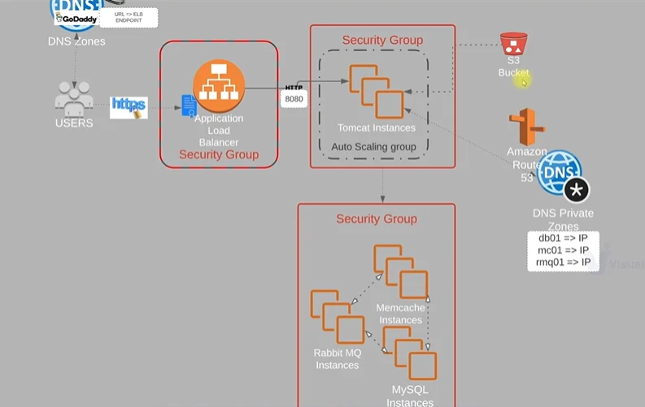

# 🚀 VProfile Lift & Shift Architecture on AWS


## 🏗️ Architecture Diagram


This project demonstrates a **production-style Lift & Shift deployment** of the **VProfile Java application** on AWS using **EC2, ALB, Auto Scaling, Route 53 (Private DNS), S3, IAM, and Maven**.

The goal is to deploy a **scalable, secure, and highly available application architecture** using AWS best practices.

---

## 📌 Architecture Overview

**High-level flow:**

```
Internet
   ↓
Application Load Balancer (HTTP/HTTPS)
   ↓
Auto Scaling Group (Tomcat App Servers)
   ↓
Backend Services (MySQL, Memcached, RabbitMQ)

```

- Application traffic is handled by an **Application Load Balancer**
- App servers run **Tomcat** and pull artifacts from **S3**
- Backend services are isolated using **Security Groups**
- **Private DNS** is used for internal service discovery
- Auto Scaling ensures **high availability and scalability**

---

## 🔐 Security Group Design

### 1️⃣ Load Balancer Security Group (ELB-SG)

- Allows inbound traffic from the internet

| Protocol | Port | Source |
| --- | --- | --- |
| HTTP | 80 | 0.0.0.0/0 |
| HTTPS | 443 | 0.0.0.0/0 |

---

### 2️⃣ Application Server Security Group (App-SG)

- Used by Tomcat application servers

| Protocol | Port | Source |
| --- | --- | --- |
| HTTP | 8080 | ELB-SG |
| SSH | 22 | My IP |

> App servers initiate outbound connections to backend services.
> 

---

### 3️⃣ Backend Security Group (Backend-SG)

- Shared by **MySQL, Memcached, and RabbitMQ**

| Service | Port | Source |
| --- | --- | --- |
| MySQL | 3306 | App-SG |
| Memcached | 11211 | App-SG |
| RabbitMQ | 5672 | App-SG |
| SSH | 22 | My IP |

> Backend services accept traffic only from application servers, ensuring isolation.
> 

---

## 🌐 Internal DNS (Private Service Discovery)

To avoid dependency on changing private IPs, **Route 53 Private Hosted Zone** is used.

| Service | DNS Name |
| --- | --- |
| MySQL | `db01.vprofile.in` |
| Memcached | `mc01.vprofile.in` |
| RabbitMQ | `rmq01.vprofile.in` |
- DNS resolves to **private IPs**
- Used only for **internal VPC communication**

---

## 📦 Artifact Management (Maven + S3)

### 🔹 Build Artifact

- Application is built using **Maven**

```bash
mvn clean install

```

Output:

```
vprofile-v2.war

```

---

### 🔹 Store Artifact in S3

- Artifact is uploaded to an S3 bucket

```bash
aws s3cp target/vprofile-v2.war s3://vprofile-las-artifacts-09/

```

---

## 🔑 IAM & Access Control

- **IAM Role** is attached to App Servers
- Role has permission to **read artifacts from S3**
- No access keys stored on EC2 (best practice)

---

## 🖥️ Application Deployment on Tomcat

### Install AWS CLI on App Server

```bash
snap install aws-cli --classic

```

---

### Pull Artifact from S3

```bash
aws s3cp s3://vprofile-las-artifacts-09/vprofile-v2.war /tmp/

```

---

### Deploy Application as ROOT App

```bash
systemctl stop tomcat10

ls /var/lib/tomcat10/webapps/

rm -rf /var/lib/tomcat10/webapps/ROOT

cp /tmp/vprofile-v2.war /var/lib/tomcat10/webapps/ROOT.war

systemctl start tomcat10

ls /var/lib/tomcat10/webapps/

```

> Deploying as ROOT.war allows access without context path
> 
> 
> Example: `http://<ALB-DNS>/`
> 

---

## ⚖️ Load Balancer Configuration

- **Target Group**
    - Port: `8080`
    - Health checks on HTTP `8080`
    - App instance registered
- **Application Load Balancer**
    - HTTP: `8080`
    - HTTPS: `443` (optional, using ACM)
    - Forwards traffic to target group

---

## 🔄 Auto Scaling Group (ASG)

### Steps followed:

1. Created **AMI** from configured App Server
2. Created **Launch Template**
    - Instance type: `t2.micro`
    - Security Group: `App-SG`
    - IAM Role attached
3. Created **Auto Scaling Group**
    - Attached to Target Group
    - Health checks via ALB
    - Desired / Min / Max capacity configured
    - CPU Target Tracking: **50%**
4. Enabled **Target Group Stickiness**
    - Ensures session persistence

---

## 📈 Key Learning Outcomes

- Lift & Shift migration using AWS IaaS
- Secure Security Group–to–Security Group communication
- Internal DNS using Route 53 Private Hosted Zone
- Artifact management with Maven + S3
- IAM roles for secure EC2 access
- Auto Scaling with ALB integration
- Production-style Tomcat deployment

---

## 🧠 Interview Highlights

- Demonstrates real-world AWS networking and security
- Uses best practices (IAM roles, private DNS, SG isolation)
- Shows understanding of scalability and high availability
- Cost-aware (free-tier friendly with minimal overages)

---

## 📎 Future Enhancements

- HTTPS with ACM certificate
- CI/CD using Jenkins or GitHub Actions
- Containerization using Docker
- Migration to Amazon RDS
- Monitoring with CloudWatch alarms

---

## 👤 Author

**Aman Srivastava**

DevOps / Cloud Engineer
